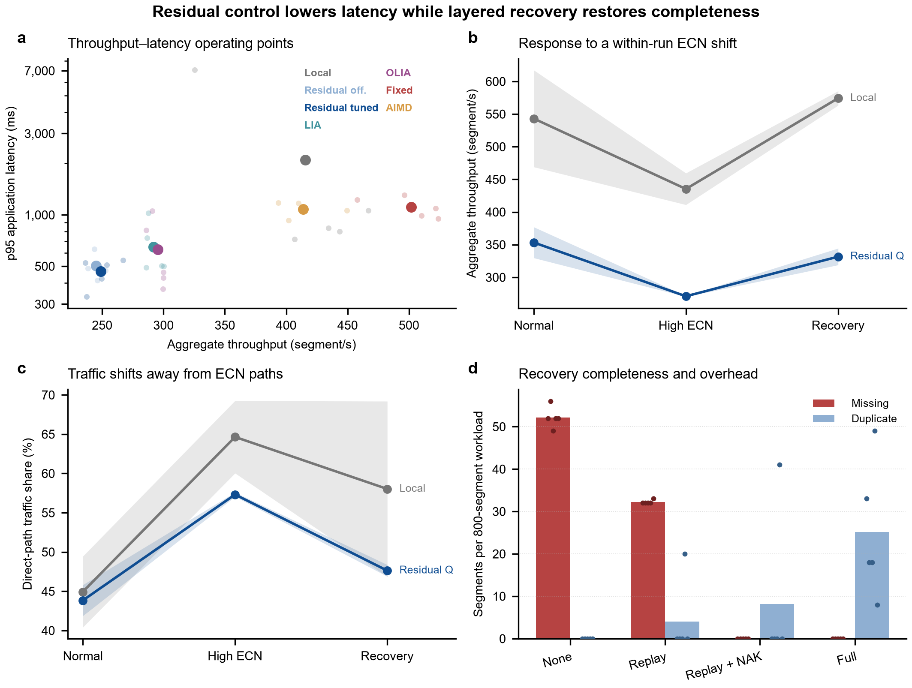

# P4 遥测驱动的 MPTCP 控制与恢复实验

本仓库保存一套面向异构多路径网络的 MPTCP 实验系统，包括用户态 MPTCP 语义原型、P4/BMv2 数据面、ECN/Credit 拥塞反馈、受约束残差 Q 控制、分层故障恢复，以及 Linux 内核原生 MPTCP 独立参考实验。仓库仅保留当前实验代码、正式结果、统计汇总和可复核图件。

## 实验总结

实验主要回答三个问题：

1. P4 全局遥测与残差控制能否在异构路径上形成可解释的拥塞控制行为？
2. replay、NAK/SACK 和主动尾部恢复能否在确定性路径故障下恢复完整数据？
3. Linux 内核原生 MPTCP 在同一强异构 P4 拓扑中表现出怎样的吞吐、时延和故障容错特征？

结果表明，残差 Q 控制器选择了更保守的低时延、低吞吐工作点；动态实验验证了控制闭环会随 ECN 变化调整窗口与路径份额；分层恢复能够实现 800/800 段完整交付，但需要以额外重复段换取完整性和尾部时延改善。Linux 原生 MPTCP 在强异构路径上存在明显的队头阻塞和吞吐代价，但能显著缩短主路径黑洞造成的交付中断。

## 实验系统与使用方法

### 1. 用户态 MPTCP 语义原型

- **拓扑**：16 个网络命名空间、3 台 BMv2 交换机；每个连接包含 direct 路径和交换机路径。
- **路径异构性**：交换路径配置为 25/60/140 Mbps，并具有不同 ECN 阈值、时延、抖动和丢包特征。
- **传输语义**：子流使用 SSN，连接级数据使用 DSN；接收端进行去重、乱序缓存和按序重组。
- **拥塞反馈**：P4 数据面记录全部出口的 ECN 信息，控制器按新增报文数计算流量加权 ECN；直连路径使用 Credit 反馈。
- **控制方法**：在 ECN/Credit 局部基线上叠加受约束残差 Q 动作，限制控制器只能从预定义残差乘数中选择。
- **比较方法**：固定窗口、无 RL 的 ECN/Credit、pseudo-Reno、LIA-inspired、OLIA-inspired、离线残差 Q 和微调残差 Q，共 7 种模式。

### 2. 动态拥塞实验

单次连接依次经历正常、高 ECN 和恢复三个阶段，连续记录吞吐、拥塞窗口、ECN 比例、direct 路径份额和接收时延，用于检查控制闭环是否随网络状态变化而响应。

### 3. 故障恢复消融

每轮固定发送 800 个唯一 DSN，在发送端出口制造 100% 丢包黑洞，并比较四级机制：

| 阶段 | 启用机制 |
|---:|---|
| 0 | 无恢复 |
| 1 | replay |
| 3 | replay + NAK/SACK |
| 15 | replay + NAK/SACK + stall/tail recovery |

实验同时统计唯一交付、缺失段、重复段和 P95 时延，避免只根据按序水位判断恢复是否完成。

### 4. Linux 原生 MPTCP 参考

独立参考实验运行在 Linux `6.8.0-138-generic`，比较单路径 TCP 与内核原生 MPTCP 的静态传输、动态 ECN 和主路径黑洞行为。每个 MPTCP 运行都通过 `MPTCP_INFO` 和 `ss` 核验至少两条已建立内核子流。

原型记录逐子流到达时延，原生实验记录有序字节流交付时延。两套实验的定义不同，只能分别分析，不能合并或进行直接配对比较。

## 实验步骤

### 步骤 1：准备原型实验环境

用户态原型需要带 P4/BMv2、Mininet 和 Python 2 的实验容器：

```bash
docker start p4app
```

### 步骤 2：运行正式原型实验

以下实验应逐项运行。脚本会构建拓扑、编译 P4 程序并将结果写入 `mptcp_exp/results/`。

```bash
# 7 种拥塞控制模式，每种 5 次
docker exec p4app bash -lc "cd /workspace && python2 -u mptcp_exp/run_mptcp.py --cc 5"

# 正常、高 ECN、恢复三阶段动态实验，每种控制模式 3 次
docker exec p4app bash -lc "cd /workspace && python2 -u mptcp_exp/run_mptcp.py --dynamic"

# 运行 0、1、3、15 四级故障恢复消融
docker exec p4app bash -lc "cd /workspace && python2 -u mptcp_exp/run_mptcp.py --ablate-all"
```

### 步骤 3：运行原生参考实验

原生套件需要支持 MPTCP 协议 262 的 Linux 内核、KVM/QEMU、BMv2 和网络命名空间。确认宿主机和虚拟机环境满足要求后运行：

```bash
python3 mptcp_exp/run_native_reference.py --name reference_v1
```

也可以使用 `--scenario static`、`--scenario dynamic` 或 `--scenario fault` 单独运行一个场景，并用 `--reps` 指定重复次数。

### 步骤 4：重建统计与图件

```bash
python3 mptcp_exp/analyze_paper_results.py
python3 mptcp_exp/make_paper_evidence_figure.py
python3 mptcp_exp/analyze_native_reference.py
```

上述两个包含 `paper` 的文件名是现有实验分析路径名，为保持复现兼容性而保留；其输出是实验统计、Source Data 和图件。图形对齐与碰撞检查由 `audit_panel_alignment.py` 完成。

## 统计与评价方法

- 独立实验单位为一次完整运行，不将轮内报文、记录或轮询采样点当作独立样本。
- 拥塞控制与故障恢复每个条件 `n=5`；动态原型实验每种模式 `n=3`。
- Linux 原生参考的静态与故障场景每协议 `n=5`，动态场景每协议 `n=3`。
- 模式顺序或 TCP/MPTCP 顺序在重复内随机化，不进行事后重复或离群值排除。
- 结果报告均值、样本标准差和双侧 95% t 置信区间；RL 与无 RL 基线仅在相同重复编号内计算配对差值。
- 样本量较小，结果用于描述效应量、机制行为和工程边界，不用于宣称普遍优越性。

## 主要实验结果

### 1. 拥塞控制形成明确的吞吐—时延权衡

| 模式 | 总吞吐均值 [95% CI] (segment/s) | 平均时延 [95% CI] (ms) | P95 时延均值 (ms) |
|---|---:|---:|---:|
| 固定 cwnd=32 | 501.9 [468.4, 535.5] | 233.2 [216.9, 249.6] | 1112.7 |
| ECN/Credit（无 RL） | 415.4 [347.5, 483.3] | 258.5 [38.5, 478.5] | 2095.0 |
| pseudo-Reno | 413.9 [387.3, 440.5] | 188.8 [170.1, 207.4] | 1082.2 |
| OLIA-inspired | 295.2 [287.2, 303.2] | 107.1 [92.8, 121.4] | 625.1 |
| LIA-inspired | 291.8 [283.2, 300.4] | 107.0 [87.9, 126.0] | 650.4 |
| 残差 Q（微调） | 248.8 [233.1, 264.5] | 96.1 [75.1, 117.0] | 465.7 |
| 残差 Q（离线） | 245.0 [238.6, 251.4] | 93.0 [73.0, 112.9] | 502.5 |

与同轮无 RL 基线相比，微调残差 Q 的平均吞吐下降 166.6 segment/s，即 40.1%（配对 95% CI：-224.1 至 -109.1）；平均时延下降 162.5 ms，即 62.8%（配对 95% CI：-381.4 至 56.4）。由于时延差区间跨 0，只能将其解释为观察到的下降趋势。离线与微调 Q 的贪心动作序列相同，当前数据不支持微调产生额外收益。

### 2. 动态闭环能够响应 ECN 阶跃

高 ECN 阶段中，无 RL 模式的平均吞吐由 543.2 降至 435.3 segment/s，平均 cwnd 由 24.46 降至 16.71；残差 Q 模式的平均吞吐由 353.3 降至 270.9 segment/s，平均 cwnd 由 11.68 降至 8.47。恢复阶段两种模式的吞吐和窗口均出现回升，同时 direct 路径份额发生变化。

这说明闭环能够响应拥塞并重新分配路径，但三个阶段的离散状态主要都落在状态 4，因此不能据此证明 Q 表实现了多状态学习切换。

### 3. 分层恢复实现完整交付，但存在冗余代价

| 阶段 | unique delivered | missing | duplicates | P95 时延 (ms) |
|---:|---:|---:|---:|---:|
| 0：无恢复 | 747.8 | 52.2 | 0.0 | 1023.0 |
| 1：replay | 767.8 | 32.2 | 4.0 | 897.7 |
| 3：replay + NAK/SACK | 800.0 | 0.0 | 8.2 | 1397.9 |
| 15：完整恢复 | 800.0 | 0.0 | 25.2 | 914.2 |

表中为每条件 `n=5` 的均值。NAK/SACK 和完整恢复均在 5/5 次运行中达到 800/800 段完整交付；完整恢复相对 NAK/SACK 将 P95 均值降低约 34.6%，但平均重复段由 8.2 增至 25.2。

### 4. 原生 MPTCP 提升故障容错，但受强异构路径拖累

| 场景 | TCP | Linux MPTCP | 观察结果 |
|---|---:|---:|---|
| 静态总吞吐 (segment/s) | 568286.3 ± 17430.4 | 58648.0 ± 17313.0 | 默认调度器受到慢路径和队头阻塞影响 |
| 静态平均有序时延 (ms) | 3.27 ± 0.37 | 105.20 ± 20.00 | 强异构路径显著增加有序交付时延 |
| 黑洞最大交付间隔 (s) | 6.40 ± 0.02 | 0.71 ± 0.26 | MPTCP 将中断缩短约 88.9% |
| 黑洞完整交付 | 5/5，800/800 | 5/5，800/800 | 两者最终均完整交付 |

该结果只描述当前拓扑、默认内核调度器和软件交换环境，不代表 Linux MPTCP 在一般网络中弱于 TCP，也不能与用户态原型结果直接比较。

## 取得的成果

- 建立了包含 direct 路径和三类异构交换路径的 16 节点可重复实验拓扑。
- 实现了全出口、流量加权的 P4 ECN 观测，避免只读取单一出口造成的遥测偏差。
- 完成 7 种拥塞控制方法的统一比较，并同时报告吞吐、平均/P95/P99 时延、Jain 公平性和连接失败。
- 构建了正常—高 ECN—恢复的单连接动态实验，验证窗口调整和路径重分配过程。
- 构建了固定工作量、确定性 DSN 缺口的故障方法，避免路径恢复或内核补传掩盖真实缺口。
- 实现 replay、NAK/SACK 和 stall/tail recovery 分层恢复，在正式实验中达到 5/5 次完整交付。
- 增加 Linux 内核原生 MPTCP 独立参考，26 次正式运行全部完成，13/13 次 MPTCP 运行均通过多子流核验。
- 形成可追溯的原始 JSON、统计汇总、Source Data、PNG/SVG/PDF 图件及图形 QA 记录。

## 结果图

### 用户态原型汇总



### Linux 原生 MPTCP 参考


## 已知限制

- 核心系统是 network namespace + BMv2 上的用户态 MPTCP 语义原型，并非 Linux MPTCP 内核实现。
- LIA、OLIA 和 Reno 是统一实验框架中的近似实现，因此分别标记为 LIA-inspired、OLIA-inspired 和 pseudo-Reno。
- 当前只有一个拓扑种子和三条前景流，正式重复数为 `n=5`/`n=3`，部分置信区间较宽。
- 离线训练与最终 TCP 多子流控制环并不完全一致，且离线与微调策略的贪心动作相同。
- ECN 遥测约 1 秒更新一次，快于此时间尺度的变化可能重复使用旧观测。

## 仓库结构与结果索引

```text
.
├── EXPERIMENT_RERUN_REPORT_20260919.md   # 完整统计、结果和证据边界
└── mptcp_exp/
    ├── README.md                         # 运行入口和代码导航
    ├── MPTCP_DESIGN.md                   # 实验设计与组件说明
    ├── run_mptcp.py                      # 用户态原型实验入口
    ├── run_native_reference.py           # Linux 原生 TCP/MPTCP 参考套件
    ├── analyze_paper_results.py          # 原型结果统计（沿用既有文件名）
    ├── analyze_native_reference.py       # 原生参考统计
    └── results/
        ├── README.md                     # 正式结果索引
        ├── paper_evidence/               # 原型汇总、Source Data 和图件
        └── native_mptcp/reference_v1/    # 原生参考结果、报告和图件
```

- [完整实验结果报告](EXPERIMENT_RERUN_REPORT_20260919.md)
- [实验代码与复现入口](mptcp_exp/README.md)
- [正式结果文件索引](mptcp_exp/results/README.md)
- [原型统计汇总](mptcp_exp/results/paper_evidence/paper_evidence_summary.json)
- [Linux 原生 MPTCP 参考报告](mptcp_exp/results/native_mptcp/reference_v1/REPORT.md)

仓库不跟踪容器/虚拟机运行时、缓存、日志、pilot 数据、逐进程临时输出和可由现有矢量图重建的 TIFF 文件。
