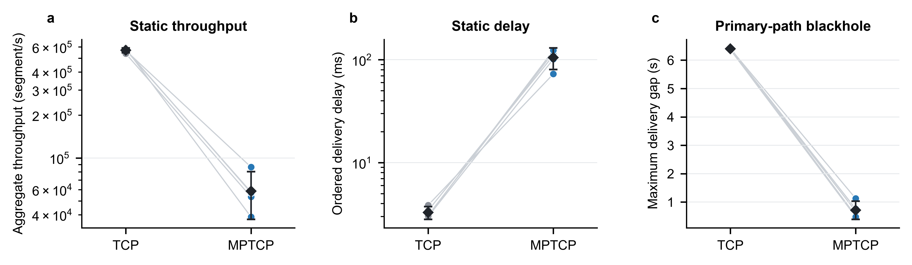

# Linux 原生 MPTCP 参考实验报告

## 统计口径

- 独立实验单位：一次完整运行；静态与故障场景每组 n=5，动态场景每组 n=3。
- 汇总为均值 ± 标准差及双侧 95% t 置信区间；未把包、记录或轮询样本当作独立重复。
- 无事后排除；失败轮次保留。TCP/MPTCP 在每个重复内随机运行顺序。
- TCP 使用初始 direct 路径；MPTCP 使用相同初始路径并接受三条交换路径通告。该对照刻画协议行为，不是带宽匹配的调度算法排名。
- 原生时延是有序字节流交付时延，不能与原用户态原型的逐子流到达时延直接合并。

## 完整性核验

- static_tcp：完整运行 5/5。
- static_mptcp：完整运行 5/5，多路径核验 5/5。
- dynamic_tcp：完整运行 3/3。
- dynamic_mptcp：完整运行 3/3，多路径核验 3/3。
- fault_tcp：完整运行 5/5。
- fault_mptcp：完整运行 5/5，多路径核验 5/5。

## 数值结果

| 场景/协议 | 吞吐 (segment/s) | 平均有序时延 (ms) | 流级 P95 均值 (ms) |
|---|---:|---:|---:|
| static_tcp | 568286.25 ± 17430.37 [546647.06, 589925.44] | 3.27 ± 0.37 [2.81, 3.73] | 12.76 ± 3.54 [8.37, 17.15] |
| static_mptcp | 58647.95 ± 17312.98 [37154.49, 80141.41] | 105.20 ± 20.00 [80.37, 130.03] | 595.85 ± 93.27 [480.06, 711.64] |
| dynamic_tcp | 505067.22 ± 8608.03 [483681.96, 526452.48] | 3.26 ± 0.12 [2.96, 3.57] | 17.61 ± 3.15 [9.79, 25.44] |
| dynamic_mptcp | 58288.41 ± 8278.93 [37720.75, 78856.07] | 75.26 ± 24.75 [13.78, 136.75] | 410.79 ± 153.37 [29.78, 791.81] |
| fault_tcp | 66.67 ± 0.00 [66.67, 66.67] | 329.87 ± 12.75 [314.04, 345.70] | 3730.02 ± 3169.08 [-204.28, 7664.32] |
| fault_mptcp | 66.67 ± 0.00 [66.67, 66.67] | 422.96 ± 96.45 [303.22, 542.70] | 1151.06 ± 69.17 [1065.19, 1236.93] |

表中格式为均值 ± s.d. [95% CI]。故障恢复与动态阶段的详细指标见 `summary.json` 和 `source_data.csv`。

## 关键结果

- 静态场景中，默认 Linux MPTCP 的总吞吐均值为 58,647.95 segment/s，比单路径 TCP 低 89.7%；平均有序交付时延为 105.20 ms，是 TCP 的 32.2 倍。该结果反映默认调度器在本实验强异构路径上的队头阻塞风险，不代表一般网络中的普遍排序。
- 主路径 100% 黑洞时，两种协议均完整交付 800/800 条记录；MPTCP 将最大交付中断从 6.40 ± 0.02 s 降至 0.71 ± 0.26 s（下降 88.9%），并将完成时间提前 0.51 s。
- 动态场景存在连接升速与 ECN 阶段重叠的混杂，阶段吞吐不能单独归因于阈值变化；因此它只作为操纵核验和行为记录，不作为 Linux MPTCP 自适应优势证据。

## 配图

图中每条细线连接同一重复编号，圆点为单次完整运行，黑色菱形与误差线表示均值和双侧 95% t 置信区间；每组 n=5。a 为静态总吞吐，b 为静态有序交付时延，c 为主路径黑洞后的最大交付中断。所有 MPTCP 运行均确认至少两条 ESTABLISHED 内核子流。

## 解释边界

该实验提供“同一 P4 异构拓扑下，Linux TCP 与内核原生 MPTCP”的外部参考。它不能直接证明用户态原型优于 Linux MPTCP，因为两者的实现环境、调度器和时延定义不同；可用于回答原型与标准内核协议在语义和失效恢复行为上的差异。
